# Hi there! 👋 / Привет! 👋

🇬🇧 English

## About Me

I'm **Vadim Yehhi** — Python developer, system administrator, and automation enthusiast from Minsk, Belarus.

I build Telegram bots, web scrapers, automation tools, and backend services. Sysadmin by day (120+ workstations), freelance dev by evening.

## 🛠 Tech Stack

## 🚀 Key Projects

| Project | Description | Stack |
|---------|------------|-------|
| [StopExtremismBelarus](https://github.com/tytopop/StopExtremismBelarus) | Subscription monitor vs Belarus banned registry (4300+) | Python, Telethon, Flask |
| [navidrome-radio](https://github.com/tytopop/navidrome-radio) | Navidrome library → live Icecast radio stream | Shell, Python, Liquidsoap |
| [bentoFFStart](https://github.com/tytopop/bentoFFStart) | Minimal hackable browser startpage (fork) | JavaScript |
| [expense-tracker-bot](https://github.com/YehhiAleksandra/expense-tracker-bot) | Moved to YehhiAleksandra — 4 envelopes + Notion | Python |

## 📧 Contact

## ⏰ Availability

Freelance: **weekdays 19:00–23:00, weekends 12:00–16:00 (GMT+3)**

---

🇷🇺 Русский

## Обо мне

Я — **Вадим Егги**, Python-разработчик, системный администратор и фанат автоматизации из Минска.

Telegram-боты, парсеры, backend, DevOps. Днём — 120+ РМ, вечером — фриланс.

## 🚀 Ключевые проекты

| Проект | Описание | Стек |
|--------|----------|------|
| [StopExtremismBelarus](https://github.com/tytopop/StopExtremismBelarus) | Мониторинг подписок по реестру РБ | Python, Telethon, Flask |
| [navidrome-radio](https://github.com/tytopop/navidrome-radio) | Живое радио из Navidrome | Shell, Python, Liquidsoap |
| [bentoFFStart](https://github.com/tytopop/bentoFFStart) | Минималистичная стартовая страница | JavaScript |
| [expense-tracker-bot](https://github.com/YehhiAleksandra/expense-tracker-bot) | Перенесён к YehhiAleksandra | Python |

## 💼 Услуги

- 🤖 Telegram/WhatsApp боты
- 🕷 Парсинг и автоматизация
- 🧠 AI в ботах
- 🖥 Серверы и DevOps

## 📧 Контакты

---

## Star History

---

